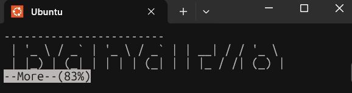

# Level 25-25: Logging in to bandit26 from bandit25 should be fairly easy… The shell for user bandit26 is not /bin/bash, but something else. Find out what it is, how it works and how to break out of it.

## Password
s0773xxkk0MXfdqOfPRVr9L3jJBUOgCZ
## Method
Find the shell for user bandit26, switch back to /bin/bash shell
```
cat /etc/passwd | grep bandit26
bandit26:x:11026:11026:bandit level 26:/home/bandit26:/usr/bin/showtext
```
- This output has been broken down [here](#what-i-learned)

Inspected the shell script file
```
cat /usr/bin/showtext
#!/bin/sh

export TERM=linux

exec more ~/text.txt
exit 0
```
- export TERM=linux is setting an evironment variable, TERM defines the terminal type
- `more` allows you to read the contents of a large text file one screenful at a time i.e. it is displaying '~/text.txt' which is a large 'bandit26' icon, `less` is similar to `more` but has more features e.g. allows you to scroll both forwards and backwards through a file whereas `more` only goes forwards
- exit 0 is what is causing you to be kicked out of bandit26 immediately upon login

- It's possible to break out of the `more` command and go into vim if whatever is being read, is larger than what can fit on the screen
- You can minimise the screen so that the text is too large to fit on the screen, causing `more` to pause and partially load whatever is able to fit on the screen
- From there, vim commands become available e.g. :set shell? - to see the current shell, :set shell=/bin/bash - to set the shell to bash, :shell - to open a sub-shell

I exited and attempted the login to bandit26
```
exit
scp -P 2220 bandit25@bandit.labs.overthewire.org:~/bandit26.sshkey ~/
```
- You first specify the file that will be copied i.e. ~/bandit26.sshkey, then the destination ~/ (my home directory).
- [~/] is a shortcut for the home directory, the full path can also be used.

Used the private key to login to bandit26 via default user
```
ssh -i bandit26@bandit.labs.overthewire.org -p 2220
```
- Before hitting enter, I minimised the screen so that `more` would be forced to freeze
- This is because it would only be able to partially load the text file relative to the size of the screen
- I am still able to maximise the screen while it's in this frozen state, which looks like this:




From here, I hit 'v' to open `vim` from within `more` and then ran these `vim` commands in their respective order

```
:set shell=/bin/bash
```
This set the shell to Bash, changing it from showtext.

```
:set shell?
```
This displays the current shell i.e. the current shell is now Bash so it displayed `shell=/usr/bin/bash`.

```
:shell
```
This opens a sub-shell within vim which is now a Bash sub-shell.

I'm now able to interact with the filesystem as bandit26 after doing `ssh -i` into bandit26 at the beginning so I can now read the password file.
```
cat /etc/bandit_pass/bandit26
```

### What I learned:
[bandit26:x:11026:11026:bandit level 26:/home/bandit26:/usr/bin/showtext]  
- bandit26 is the username
- x is where passwords used to be, but are now stored in the encrypted /etc/shadow file
- 11026 is the user numerical id, followed by the group numerical id
- bandit level 26 is a comment field
- /home/bandit26 is the home folder for that particular user
- /usr/bin/showtext is the **shell**

(Every time you login, a shell is started based on what's configured in /etc/passwd for that user. This is normally a standard shell like /bin/bash or /bin/zsh but in this level, bandit26 has been set to a custom shell (showtext)).