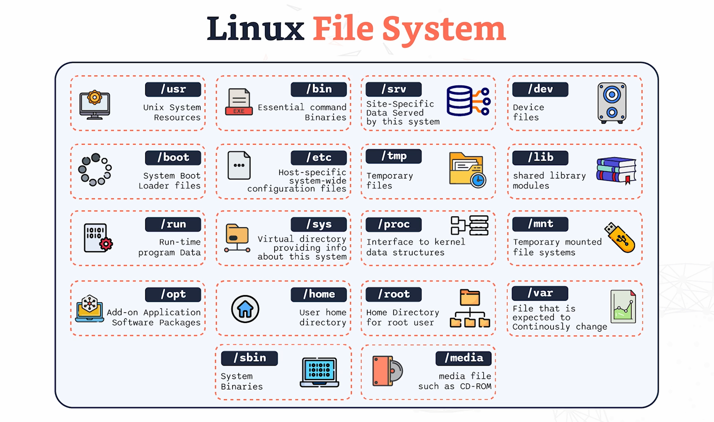

# Linux File System

## Key Concepts

- bin directory contains essential binary executables like ls,pwd,sudo
- dev holds device files which represent devices attached to the system like discs and terminals
- etc contains system-wide integration files, user account info, and shell scripts which are used to boot and initialise the file system

