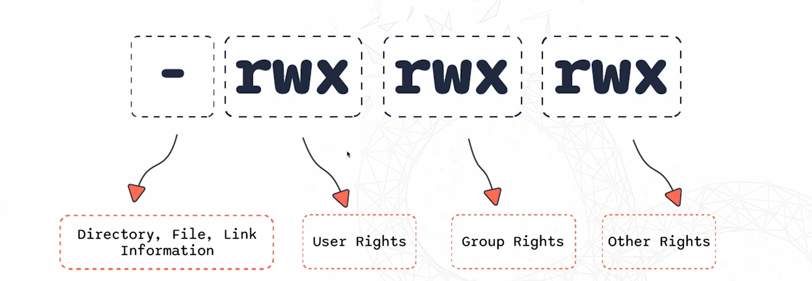
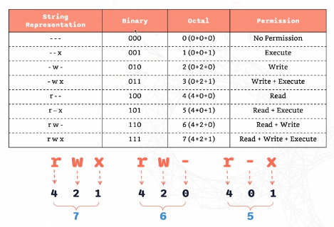

# Users and Permissions

## Key Concepts

- Every file and directory has permissions that control who can read,write or execute it
- A "Permission Denied" error may cccur when you try to write to a location you don't have access to. (Navigate to home directory with cd ~ where you have full write permissions)
- You can also use [ls -l](02-Commands.md) to view permissions where you may see **[-rwxr-xr--](#file-permissions)** which shows what each user type is allowed to do

## The 'sudo' Command

- The ['sudo' command](02-Commands.md), meaning superuser do. provides elevated privileges to a **permitted** user
- 'sudo !! tab' is a shortcut that uploads the previous command 
- Editing system files also require superuser privileges e.g. Using 'vim etc/hosts' won't allow editing or saving, warnings will occur stating that the file is a 'readonly'; using 'sudo vim etc/hosts' will allow you to make these changes
- sudo ls /root lists the contents of the root directory and can only be read by those with sudo permission

## The Root User

- 'sudo su' switches you to the root user altogether, use 'whoami' to view your current user
- The '#' at the end of your username also shows that you are the root user, use ['exit'](02-Commands.md) to return to normal user
- rm -rf / deletes everything from the root down, only the root user can run that command
- All sudo commands you have used are logged in `/var/log/auth.log', run 'sudo tail /var/log/auth.log' to see recent activity

## Users

- New users can be added with **['sudo useradd'](02-Commands.md)** and set with their own passwords using **['sudo passwd'](02-Commands.md)**, you can switch to them with **['su'](02-Commands.md)** meaning substitute user

Practical Example: 'sudo useradd newuser, sudo passwd newuser, su - newuser
(newuser is the example username)

- a warning may occur when switching to the new user immediately after creating it, this is because the directory for it does not exist, use 'whoami' to ensure you are in the new user
### Granting and Revoking 'sudo' Access

- to grant this new user sudo privileges, run **['sudo usermod -aG sudo newuser'](02-Commands.md)** in your normal user who is already in the sudo group
- to remove sudo privileges from this user, run **['sudo deluser newuser sudo'](02-Commands.md)** in your normal user

## Groups

- 'cat /etc/group' displays all the groups with the linux file system
- when a user is added to a specific goup, they are permitted to use that group's proprietary capabilities e.g. 'newuser' was added to the sudo group by using 'sudo usermod -aG' followed by the specified group and username
- Users can be **added to multiple groups** by including multiple group names when using 'sudo usermod -aG' and separating them with a comma, **for example:'sudo usermod -aG admin1,admin2 newuser'**
### Important Commands

- new groups can be created with **['sudo groupadd groupname'](02-Commands.md)**
- likewise **['sudo groupdel groupname'](02-Commands.md)** deletes the specified group
- **['sudo gpasswd -d newuser devops'](02-Commands.md)** removes 'newuser' from the devops group

## File Permissions

- file permissions control who can read(r), write/modify(w), and execute(x) a file
- permissions are assigned to the 3 categories listed below:

- the **user** category is the owner of the file and the user you are logged in as, the **group** category is the group of users with similar permissions, **other rights** represents everyone else/the public's permissions

## Binary, Octal and String Representation

- r,w,x are always equivalent to 4,2,1 respectively
- the octal notation or string representation can be used when setting file permissions in the command line
- this is paired with **'[chmod](02-Commands.md)'** to change the permissions of a file or directory 

### Practical Example

Using 'ls -l', displays the permissions of example.txt which are 'rw-r--r--'. This means that:
- the user only has read and write permissions (rw-)
- the group has read only permission (r--)
- the public has read only permission (r--)

Running 'chmod 750 example.txt'(octal notation) or 'chmod u+x,g+w,o-r example.txt'(string representation), grants:
- full permissions to the user
- read + write permissions to the group
- removes all permissions from the public

Tip: You can apply a specific permission to all categories by not specifying any category so 'chmod +x example.txt" grants all parties execute permission.
