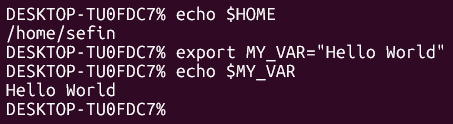
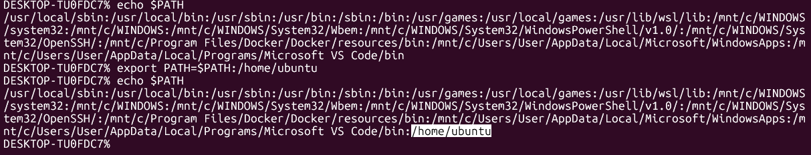
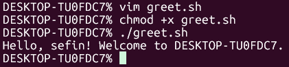
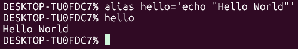

# Environment Variables and Aliases

## Key Concepts

- a **variable** is a named value that can be stored and reused
- an **environment variable** is a variable stored in the shell that holds information used by the system and commands
- a **special shell variable** is a variable that is automatically set and maintained by the shell itself, that holds information about the current shell process and its execution
- a **[shell](/01-linux/notes/03-Shells-and-Programs.md)** is the environment in which variables are set and accessed

Some examples of Environment Variables are:

- $HOME: gives path of home directory
- $PATH: tells the system where to look for executable files
- $EDITOR: gives default file editor
- $HOSTNAME: gives name of the host
- $LANG: gives the default system language
- $PWD: gives the path of present working directory
- $UID: gives user ID of current user
- $USER: gives the username of the current user
- $SHELL - the shell program in use

Some examples of Special Shell Variables are:

- $0: holds the name/path of the currently running shell or script
- $1-$9: The first nine arguments passed to a script
- $?: holds the exit code of the last command that ran
- $$: holds the process ID (PID) of the current shell

## Setting Environment Variables

There are 2 ways of setting environment variables:

**Temporary Setting**: 'export NAME = VALUE' temporarily sets environment variable in the current terminal session

**Example:** 

- [echo $HOME] accesses the the environment variable
- [export MY_VAR="Hello World"] sets the variable MY_VAR with the value "Hello World"
- [echo $MY_VAR] used to ensure it has been set

**Permanent Setting**: adding 'export NAME = VALUE' into 'vim .bashrc or .zshrc' permanently sets environment variable so it loads automatically everytime the shell starts

**Example:**
- [vim .zshrc] accesses the configuration file
- [export MY_VAR="Hello World"] is added to a new line, then save and exit
- [source .zshrc] applies changes without restarting the terminal
- [echo $MY_VAR] used after restarting terminal, to ensure it has been set permanently

*Bashrc and Zshrc are configuration files located in the home directory containing configuration of specific shells.

## Adding to Environment Variables

- to add directories to existing environment variables e.g. $PATH, run [export PATH=$PATH:/home/ubuntu]
- any executable script in **/home/ubuntu** will be recognised as a program as $PATH is where the system looks for executables

**Example:**

- [export PATH=$PATH] the PATH variable will be updated along with what it already contains ($PATH)
- [:/home/ubuntu] the colon signifies that the following directories will be added
- [echo $PATH] view the PATH environment variable to see that the change has been made

The system will now look for executables in the **/home/ubuntu** directories so it can run any executable script within it.

- [vim greet.sh] creates and opens the greet.sh file
- [#!/bin/bash
'# A simple script to greet the user'
echo "Hello, $USER! Welcome to $HOSTNAME."] the script that was inserted into greet.sh
- [chmod +x greet.sh] grants execute permission to greet.sh, turning it into an executable file
- [./greet.sh] runs the executable file

## Aliases

### Key Concepts

- aliases are shortcuts that allow you to create custom commands 
- this is useful for commands that you will use frequently, whether they're for git, docker, kubernetes
- run 'alias' in the terminal to view the list of current aliases

**Example:**

- this method creates a **temporary alias**
- to create a **permanent alias**, insert [alias hello='echo "Hello World"'] into [vim .zshrc] and save with [source .zshrc]

