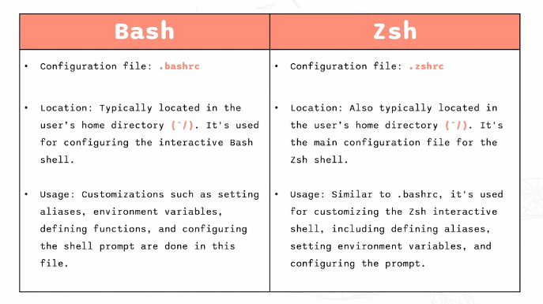

# Environment Variables and Aliases

## Key Concepts

- a **variable** is a named value that can be stored and reused
- an **environment variable** is a variable stored in the shell that holds information used by the system and commands
- a **[shell](/01-linux/notes/03-Shells-and-Programs.md)** is the environment in which variables are set and accessed

Some examples of Environment Variables are:

- $HOME: gives path of home directory
- $PATH: tells the system where to look for executable files
- $EDITOR: gives default file editor
- $HOSTNAME: gives name of the host
- $LANG: gives the default system language
- $PWD: gives the path of present working directory
- $UID: gives user ID of current user
- $USER: gives the username of the current user
- $SHELL - the shell program in use

There are 2 ways of setting environment variables:

- **Temporary Setting**: 'export NAME = VALUE' temporarily sets environment variable in the current terminal session
 e.g. '# export JAVA_HOME = /usr/bin/java' (use 'echo $NAME' to ensure it has been set)

- **Permanent Setting**: add 'export NAME = VALUE' to '~/.bashrc or ~/.zshrc' permanently sets environment variable so it loads automatically everytime the shell starts

Tip: run 'source ~/.bashrc or ~/.zshrc' to apply changes without restarting the terminal

Bashrc and Zshrc are configuration files located in the home directory containing configuration of specific shells.

